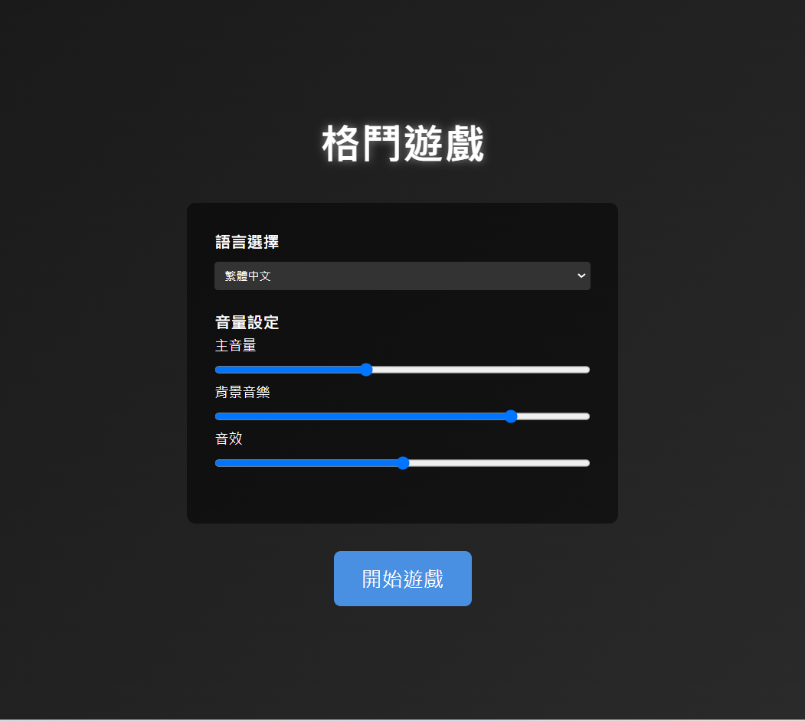
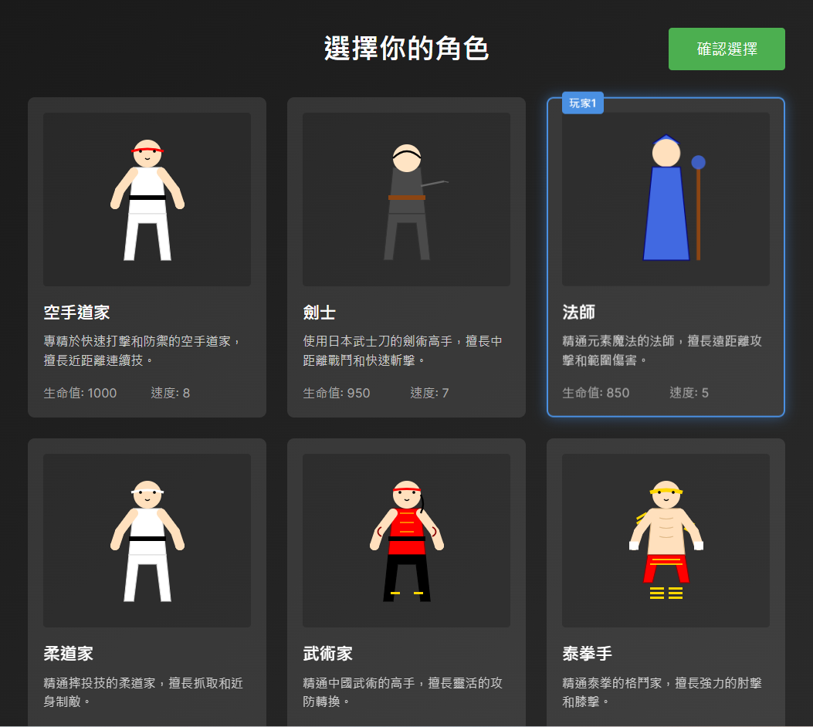
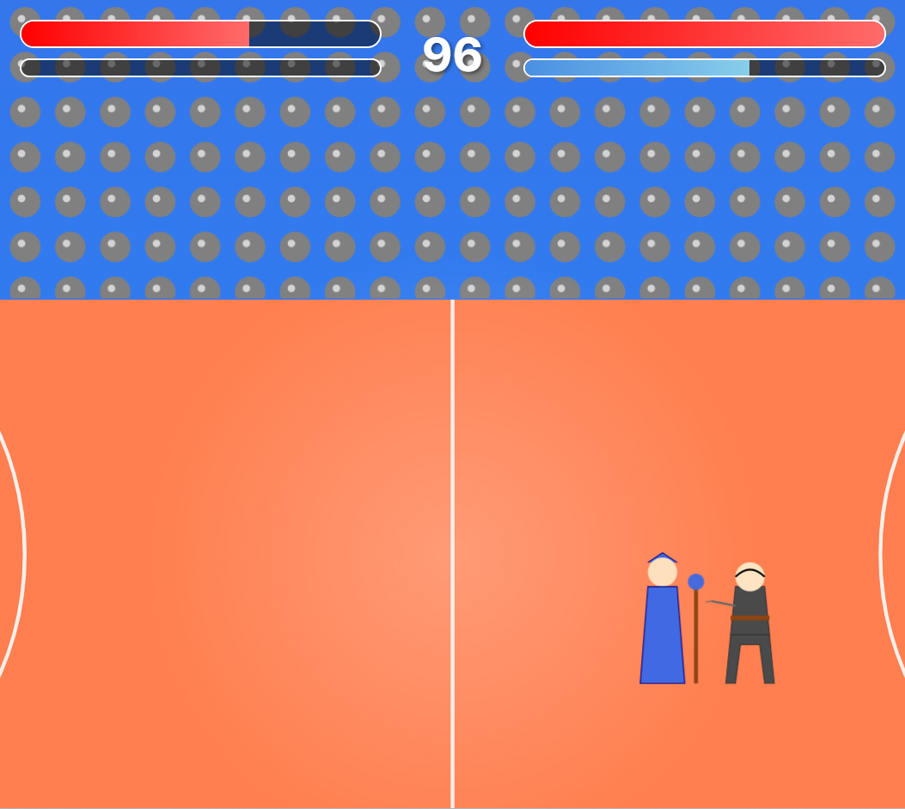

# 格鬥遊戲 Fighting Game 🥋

一個基於 TypeScript 和 React 開發的 2D 格鬥遊戲。

## 特色 ✨

- 🎮 多角色選擇系統
- ⚔️ 即時戰鬥機制
- 🌈 流暢的動畫效果
- 🎯 精確的打擊判定
- 🎨 精美的遊戲畫面
- 🤖 AI 對戰系統

## 遊戲截圖 📸

### 開始遊戲

### 選擇角色(人機隨機選擇對手)

### 戰鬥場景

## 操作方式 🎮

### 玩家 1

- `A/D` - 左右移動
- `W` - 跳躍
- `F` - 普通攻擊
- `G` - 中攻擊
- `H` - 特殊技

## 技術棧 🛠️

- ⚛️ React 18
- 📘 TypeScript
- 🎨 CSS Modules
- 🔧 Vite
- 🎵 Web Audio API

## 開發中功能 🚧

- 📱 手機支援
- 🎮 手把支援
- 🌐 線上對戰
- 🏆 排行榜系統

## 安裝與執行 🚀
